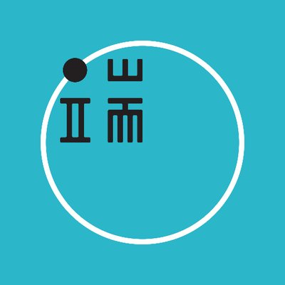

# BLOG⓪

Landing page of the Agora Blog Aggregator. 👉 https://agora0.gtilab.io/blog

## Blog Sources

| [INITIUM](https://agora0.gitlab.io/blog/initium) | [INMEDIA](https://agora0.gitlab.io/blog/inmedia) | [MATTERS](https://agora0.gitlab.io/blog/matters) | [PQ](https://agora0.gitlab.io/blog/pq) | [VOCUS](https://agora0.gitlab.io/blog/vocus) |
| -- | -- | -- | -- | -- |
|  |  |  |  |  |

## How to Contribute

[Agora Community](https://github.com/agorahub) is an open source driven society.
- Join the Agora - [agorahub/_join](https://github.com/agorahub/_join)
- Start exploring - [agorahub/_meta](https://github.com/agorahub/_meta)
- Manage features - [agorahub/blog0#3](https://github.com/agorahub/blog0/issues/3)

## Disclaimer

The information and opinions within this website are for information purposes only. They are not intended to constitute legal or other professional advice, and should not be relied on or treated as a substitute for specific advice relevant to particular circumstances. We accept no responsibility for any errors, omissions or misleading statements on this website, or for any loss which may arise from reliance on materials contained on this website. Certain parts of this site may link to external Internet sites, and other external Internet sites may link to this website. We are not responsible for the content of any external Internet sites.
